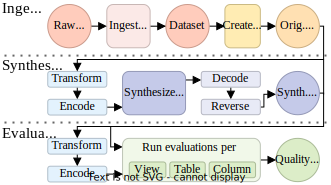
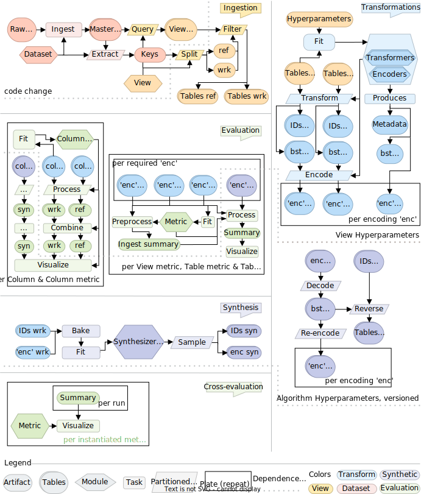

# Methodology
Pasteur is a pipeline based system based on a methodology with three stages:
ingestion, synthesis, and evaluation.
The whole process is designed to be deterministic, beginning from raw data
to evaluated product.

## Ingestion
The process begins with collecting the raw data sources.
In a Pasteur project, raw data sources are stored in the `./raw` directory by default,
but you can change this to ex. an S3 share or a different drive mount, in case it
is large.
The `./raw` data directory is considered immutable by Pasteur, and can contain
archives (`.zip`, `.tar`), SQL dumps, CSV files, JSON files or any type of file
in its raw form.

The Raw Data sources are then combined and preprocessed to form a `Dataset`.
This is done by a `Dataset` module, which contains all relevant information
required to wrangle the raw sources into a tidy form (by typing, removing unnecessary 
data, and renaming columns to adhere to project standards).
Currently, only multi-table tabular data is supported, but in the future
Pasteur should also support multi-modal data such as images, time-series, and
audio.

Datasets represent the raw data sources in full resolution.
With few exceptions, this will mean that it is intractable to synthesize them
as is.
We therefore need to downsample Datasets into a more manageable form.
We name this form a `View`.
`View` modules have an API similar to datasets and work in a similar process.
However, since the bulk of processing and typing is performed on the `Dataset`
level, `View` modules are used to select subsets of tables, rows, and columns from
the original `Dataset`, or simplify columns to a smaller domain.

The ingestion stage ends with the preprocessed `View` data.
We associate a set of hyperparameters with this `View` data, that can be used
to transform and encode for synthesis, as well as for evaluation.

## Synthesis
The next stage to data synthesis is synthesis itself.
Pasteur does not dictate a particular procedure for synthesis, other than
splitting the procedure into three stages (`bake`, `fit`, and `sample`), leaving the rest up
to the algorithm creator.
Pasteur does define a formalized procedure for encoding data and integrating domain
knowledge, which is a significant and complex task on its own.
Pasteur separates the encoding process into two reversible steps: Transformation, and Encoding.

In Transformation, complex types (such as dates) are broken down into simpler
ones (numerical, categorical values) with a formalized specification (Base Transform Layer).
This process is performed by modules named Transformers, each of which is designed
to handle a single column type.
Transformers integrate expert domain knowledge into their column transformations,
and the end result is simpler types with orthogonal information.
E.g., consider two date columns we know to be relative: `21-3-23`, `25-3-23`, they both
contain denormalized information about the year.
With a naive transformation it would be left up to the synthesis algorithm to
enforce the denormalized dates (years, months) match.
However, we can transform those two dates into: `2023`, `March`, `23`, `4 days`,
in which case the information held by each column has been normalized (no duplication).

In Encoding, the simpler column types are converted to a form suitable for the
synthesis algorithm and metric at hand.
A synthesis execution can require multiple encodings.
For Neural Network algorithms, the Base Transform Layer would be converted
into vector batches (e.g., float16/32 vectors, one-hot).
For Marginal Algorithms, the numerical columns would be discretized into bins.

Encoding and Transformation example:

## Evaluation
Finally, in evaluation, arbitrary code is executed upon the resulting data to produce a set of metrics.
Pasteur does not enforce a particular structure to what a metric is, other than enforcing certain
access patterns.
Metrics are split based on how they access data into `Column`, `Table`, and `View` metrics.
This influences how metrics are instantiated in a synthesis execution: 
- `Column`: once per column with matching type
- `Table`: once per table
- `View`: once
  
And what input they receive:
- `Column`: only their column + metadata
- `Table`: the table and its parents, and metadata for those
- `View`: View metadata and all tables

In addition, `View` and `Table` metrics may select to receive raw data, 
Base Transform Layer data, or encodings (e.g., a classifier module requires
as input continuous data and as output discrete classes).

## Appendix: Full Methodology
The full methodology and its steps can be seen below.
